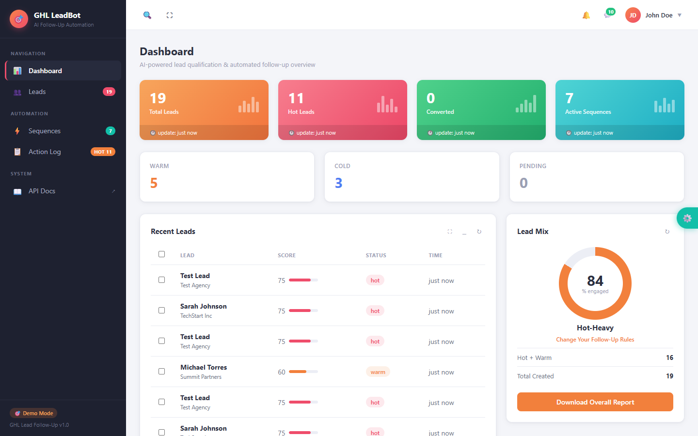
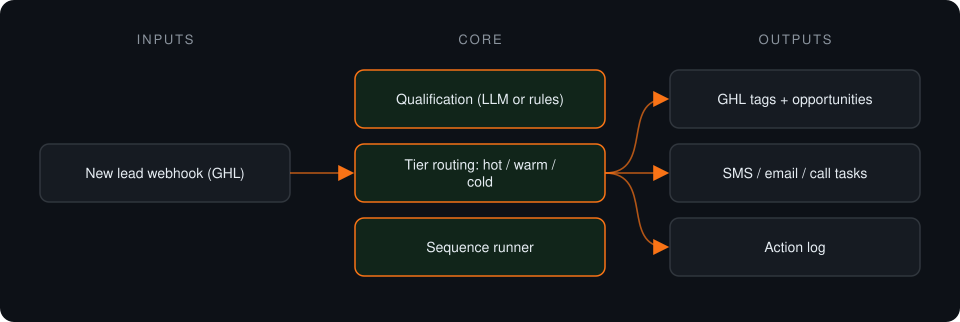
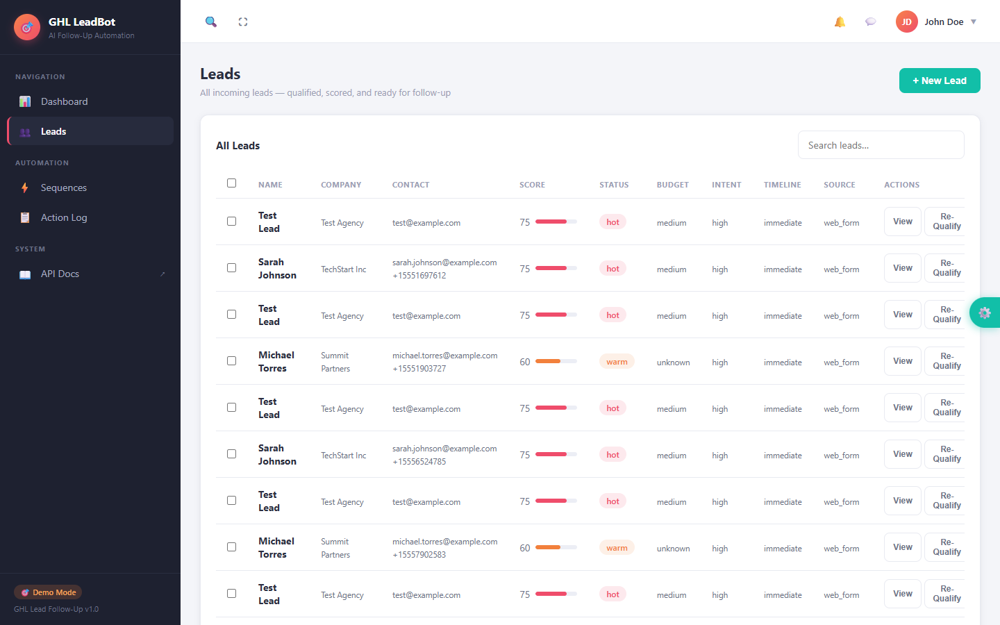
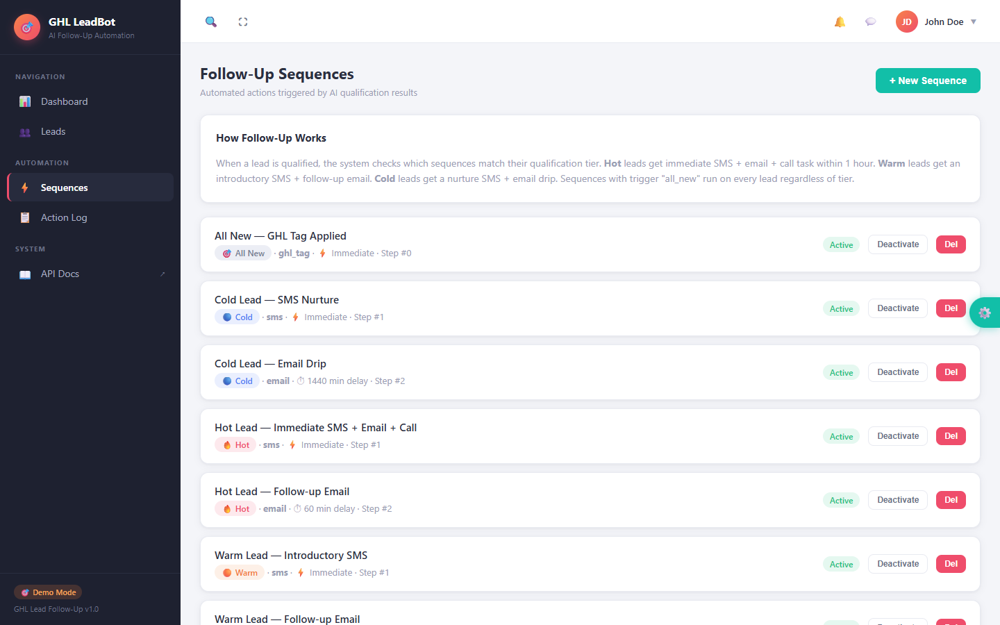
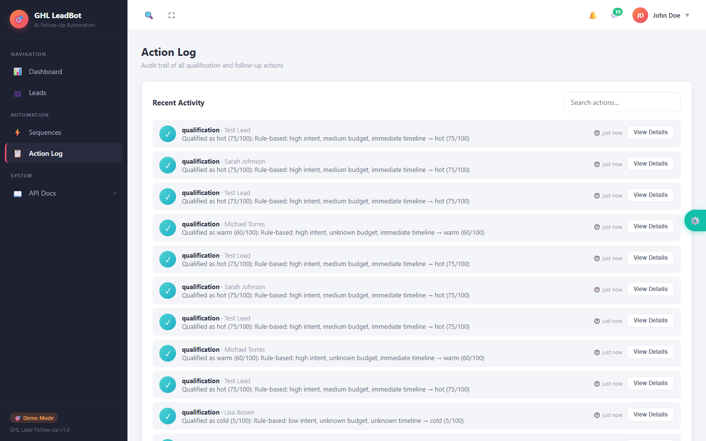

# GHL Lead Follow-Up Automation

**Qualifies each new lead by budget, intent and timeline, tags it in GoHighLevel and triggers the matching follow-up sequence.**

> **This is a proprietary project. Source code is private. This page showcases the system's architecture and results.**

**Case study page:** [https://jryahia.github.io/showcase-ghl-lead-followup/](https://jryahia.github.io/showcase-ghl-lead-followup/)

## Problem it solves

Treating every lead the same wastes effort on cold ones and leaves hot ones waiting. This system qualifies leads the moment they arrive and routes each tier into its own SMS, email or call-task sequence.

## Architecture

1. A new lead arrives from GoHighLevel.
2. It is qualified on budget, intent and timeline and given a 0-100 score and tier.
3. The lead is tagged and an opportunity created in GHL.
4. The tier's follow-up sequence fires; every action is logged.

## Key features

- Lead qualification with score and tier
- Configurable per-tier follow-up sequences
- Tags, opportunities and messages through the GHL API
- Full action log for transparency
- Runs end to end in demo mode

## Tech stack

     

## What it does in practice

- Hot leads get an immediate follow-up instead of sitting in a shared queue.

## Screenshots

**Lead overview by tier**

**Qualified leads with scores**

**Per-tier follow-up sequences**

**Action log**

---

Built by [Yahya Jarray](https://github.com/jryahia). Interested in a similar system? [Get in touch](mailto:yahiajarray43@gmail.com).
